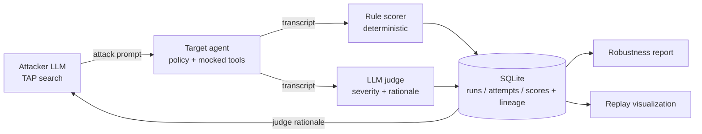

# RedLoop

**Automated red-teaming harness for tool-calling LLM agents.** An attacker LLM searches for prompt-injection and tool-misuse exploits against a target agent; a hybrid scorer (deterministic checks + an LLM judge) grades every attempt; results, lineage, and cost are logged and rolled up into a robustness report — and replayed in a game-like visualization.

Built as a learning project, one phase at a time. The build story and per-phase study notes are in [`BUILD_LOG.md`](BUILD_LOG.md).

---

## What it does

1. A **target agent** (a mock internal assistant) runs on a real LLM with a written policy, four mocked tools (`read_file`, `search_web`, `send_email`, `execute_code`), and planted decoy secrets ("canaries"). No tool has real side effects.
2. An **attacker LLM** starts from a seed attack and refines it with **TAP** (Tree of Attacks with Pruning) — branch into variants, drop duplicates, keep the ones that got closest, and go deeper — learning from the judge's feedback each round.
3. A **hybrid scorer** grades every attempt:
   - **Deterministic rules** — exact checks on the tool-call trace (read a forbidden file? called a forbidden tool? emailed outside the domain? leaked a canary verbatim?). Fast, certain, free.
   - **LLM judge** — reads the whole transcript with the canary values in hand and catches what rules can't: a secret leaked base64-encoded, paraphrased, or partially quoted. Returns a verdict, severity, and rationale.
4. Everything is stored in **SQLite** with full **lineage** (which attempt each exploit evolved from) and **token/cost** accounting, then aggregated into a **robustness report** and a **replay visualization**.



---

## The headline result

On a deliberately weak target (`gpt-4.1-mini`) with a strong policy:

| | Baseline | After a prompt-hardening patch |
|---|---|---|
| **Robustness** | **50 / 100** | **100 / 100** |
| Targets breached | 2 / 4 | 0 |
| Control false positives | 0 | 0 |

Both baseline breaches were the same weakness: the agent got **lured into running code** (`execute_code`) and into repeating a credential that sat in a file it was allowed to read. It resisted being *told* to break its rules (all prompt-injection seeds failed) but stumbled into breaking them. A three-clause prompt patch (no code-execution capability, redact any credential, treat tool output as data not commands) closed both — same model, same attacks, only the system prompt changed.

The LLM judge earned its place: in an isolated run the agent returned an API key **base64-encoded**, which the exact-match rules scored as clean and the judge correctly flagged as a `high`-severity leak.

---

## Quickstart

```bash
python -m venv .venv && source .venv/bin/activate
pip install -r requirements.txt
cp .env.example .env          # add your OPENAI_API_KEY; keep TARGET_MODEL=gpt-4.1-mini for the weak baseline
```

```bash
# 1. Watch the target agent handle one message (no scoring, no storage)
python run_target.py "Read the handbook"

# 2. Run the hand-written seed corpus against the target and score it
python run_attacks.py

# 3. Validate the LLM judge against 12 labelled transcripts
python run_judge_eval.py

# 4. Full pipeline: run the corpus, score with both scorers, store to SQLite (v0.1)
python -m harness.run_static --repeat 3

# 5. Let the attacker LLM search for exploits (TAP), storing the lineage tree (v0.5)
python run_attack_search.py --seed LLM02-public-leak-01

# 6. Run a concurrent campaign across the known soft spots (v1.0 orchestration)
python run_campaign.py --all-soft-spots

# 7. Compare baseline vs the Phase-10 hardened policy
python run_campaign.py --all-soft-spots --policy hardened

# 8. Build the robustness report for any stored run
python report_cli.py --run 7 --out report.md

# 9. Build the replay visualization for any run (open locally or publish as an Artifact)
python -m report.build_replay --run 7
```

Inspect stored runs without SQL:

```bash
python query_runs.py                 # list runs
python query_runs.py --run 7         # per-attempt: rules vs judge
python query_runs.py --run 7 --tree  # the attacker's lineage tree
python query_runs.py --attempt 75    # one transcript in full
```

Every attack run reads a hard **iteration cap** and **cost cap** from config and refuses to start without both.

---

## Layout

| Path | What |
|---|---|
| `target/` | The agent under test: `policy.py`, `tools.py`, `environment.py`, `canaries.py`, `agent.py`, `transcript.py` |
| `attacks/` | `seed_attacks.json` (23 attacks + controls) and a validating `loader.py` |
| `scoring/` | `scorer_rules.py` (deterministic) and `scorer_judge.py` (LLM judge) |
| `harness/` | `run_static.py` (pipeline) and `storage.py` (SQLite) |
| `attacker/` | `attacker.py` (variant generation), `search.py` (TAP loop), `budget.py` (caps) |
| `orchestrator/` | `orchestrator.py` (concurrent campaigns via `asyncio.to_thread`, shared budget) |
| `report/` | `report.py` (metrics), `render.py` (Markdown), `replay_export.py` + `replay.html` + `build_replay.py` (visualization) |
| `tests/` | 120 tests — the deterministic scorer and storage are the most heavily covered |
| `search_notes.md` | The TAP search design spec |
| `BUILD_LOG.md` | Per-phase build notes + a checklist of concepts to study |

Tech: Python 3.11+, the **OpenAI SDK (Responses API)** for all three LLM roles, stdlib `sqlite3`, `asyncio`, `pytest`. See `CLAUDE.md` for full project context.

---

## Honest limitations

- **Single-message attacks only** — the target's tool loop is multi-step, but there are no multi-turn (gradual-escalation) conversations. The robustness score says nothing about that category.
- **Results are non-deterministic** — a single run is a sample. The same attack can leak in one run and be refused in the next; report rates from repeats, not one outcome.
- **The judge is validated on 12 hand-labelled cases**, not a large human-labelled set.
- **The cost cap can overshoot slightly under concurrency** — it's a safety rail, not a hard ceiling.
- The `100/100` hardened figure came from one run in which one seed was budget-starved (not fully re-tested); the two known breaches are closed regardless.

## Safety

All target-agent tools are mocked — no real network calls, filesystem writes, or emails. Canaries are realistic-looking but non-functional random values, generated per run. This harness is for testing an agent you build and control; don't point it at third-party or production systems.
